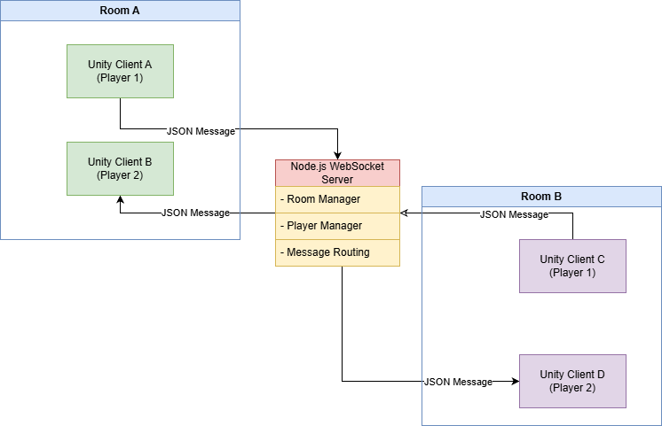
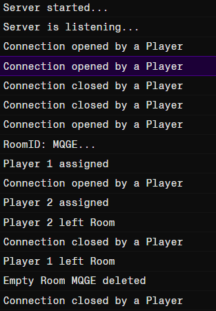

# Unity WebSocket Multiplayer Server

A real-time multiplayer server built using **Node.js** and **WebSockets** to power online multiplayer gameplay in Unity. The server handles player connections, room management, player synchronization, and message routing, enabling seamless multiplayer experiences across multiple devices.

## Live Demo

**[Play the game](https://seon-nite.itch.io/magic-twins)**

Password : multiplayer123

## Features

- Real-time communication using WebSockets
- Create and join multiplayer rooms
- Automatic player ID assignment
- Player movement and jump synchronization
- Room-based message broadcasting
- Player connection and disconnection handling
- Deployed online using Render


## Tech Stack

- Node.js
- JavaScript
- WebSocket (`ws`)
- JSON
- Render


## System Architecture



## Server Logs


## Example Messages

### Move Message:

```json
{
  "type": "move",
  "playerId": "P01",
  "x": 12.6,
  "y": 4.2
}
```

### Create Room Message:
```json
{
  "type": "createRoom",
}
```

## How It Works

1. Players connect to the WebSocket server.
2. A player can create a new room or join an existing one.
3. The server assigns a unique player ID.
4. Player actions (movement, jumping, etc.) are sent to the server.
5. The server forwards updates only to players within the same room, keeping all clients synchronized.

## Limitations

- Supports a limited number of concurrent players per room.
- Player movement is synchronized using periodic state updates, which may result in minor latency under unstable network conditions.
- No persistent player accounts or game progress storage.
- Basic room management without matchmaking or lobby discovery.
- Limited server-side validation, making the system unsuitable for production environments.


## Future Improvements

- Implement server-authoritative movement and physics validation.
- Add player authentication and persistent user profiles.
- Introduce matchmaking and public room browsing.
- Improve synchronization using interpolation and prediction techniques for smoother gameplay.
- Optimize network traffic through message compression and delta synchronization.
- Add support for additional gameplay events, animations, and object synchronization.
- Scale the backend to support larger multiplayer sessions and improved fault tolerance.
